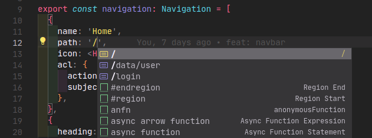

# TypeScript

TypeScript is required while working with Vivid. It provides better type-safety and linting.

:::tip

Check out the [T3 TypeScript Philosophy](https://create.t3.gg/en/usage/typescript) for more information.

:::

## Usage

TypeScript is utilized in many parts of Vivid. Here are some examples:

### Authentication

Since Vivid includes a built-in user session system, it is important to have type-safety for the user object.

```ts title="src/plugins/auth.ts"
import { type Rules } from './casl';

export type User = {
  id: string;
  name: string;
  abilities: Rules;
  role: 'admin' | 'user';
  image?: string;
};

export type SignInOptions = {
  name: string;
  password: string;
};
```

:::tip

Read more about [Authentication](/docs/usage/plugins/authentication).

:::

### Data Fetching

Similarly, data fetching is also a common use case for Typescript. For example, SWR provides a generic type for the data returned from the API.

```tsx title="src/pages/index.tsx"
import useSWR from 'swr';

type Data = {
  name: string;
  email: string;
};

export default function Home() {
  // highlight-next-line
  const { data } = useSWR<Data>('/api/user');

  return (
    <div>
      <h1>{data?.name}</h1>
      <p>{data?.email}</p>
    </div>
  );
}
```

:::tip

Read more about [Data Fetching](/docs/usage/plugins/data-fetching).

:::

### Configuration

As Vivid is a highly configurable framework, it is important to have type safety for the configuration object, as it also brings autocomplete support to your IDE.



:::tip

Read more about [Configuration](/docs/getting-started/configuration).

:::

---

Above are just some examples of how Typescript is used in Vivid. You can find more examples in the [API Reference](/docs/api/configuration).