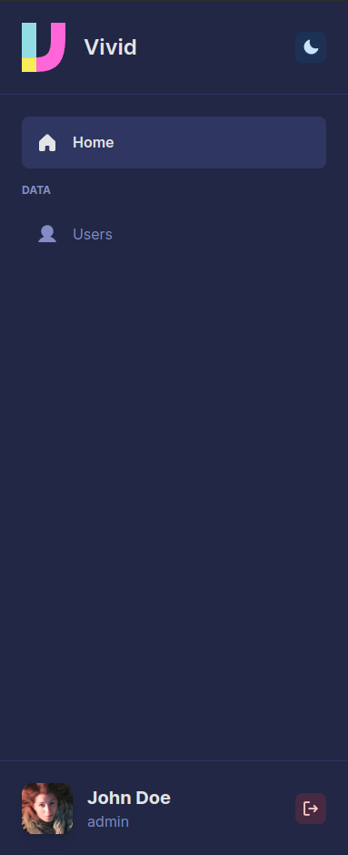

# Navigation

Vivid uses [React Router](https://reactrouter.com/) under the hood for navigation. While routing is [dynamically generated](/docs/guides/pages), you still need to configure sidebar navigation manually.

:::info

Automatic generation for sidebar navigation is planned for the future.

:::

Example:

<div className="flex gap-4">

<div className="flex-grow">

```tsx title="src/config.tsx"
import type { NavigationEntry } from './router';

// ...

export const navigation: NavigationEntry[] = [
  {
    name: 'Home',
    path: '/',
    icon: <House weight="fill" size={24} />,
    acl: {
      action: 'read',
      subject: 'other',
    },
  },
  {
    heading: 'Data',

    name: 'Users',
    path: '/data/user',
    icon: <User weight="fill" size={24} />,
    acl: false,
  },
];
```

</div>



</div>

## API

```ts
export type NavigationEntry = {
  name: string;
  children?: NavigationEntry[];
  path?: Path; // Auto-generated routes
  acl?:
    | {
        action?: Actions;
        subject?: Subjects;
      }
    | false;
  icon?: JSX.Element;
  heading?: string;
};
```